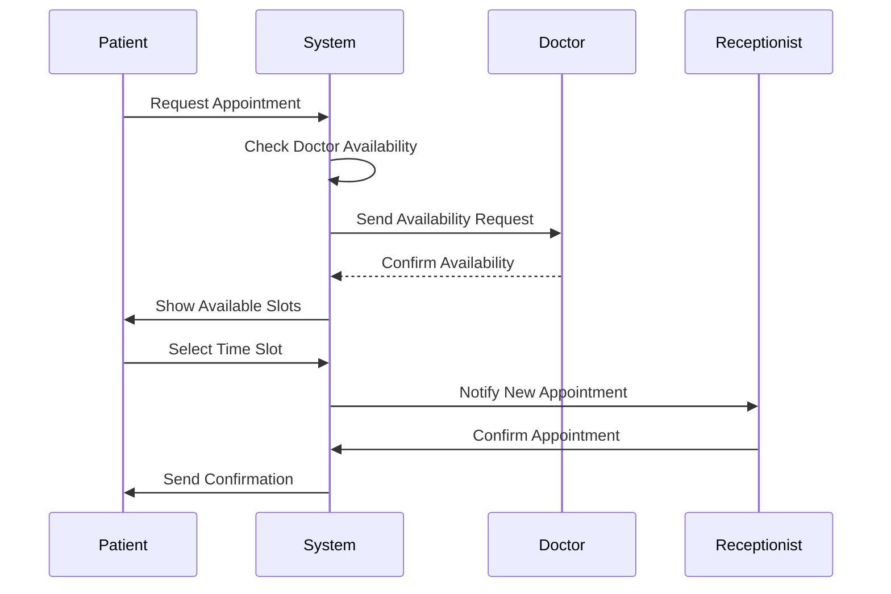
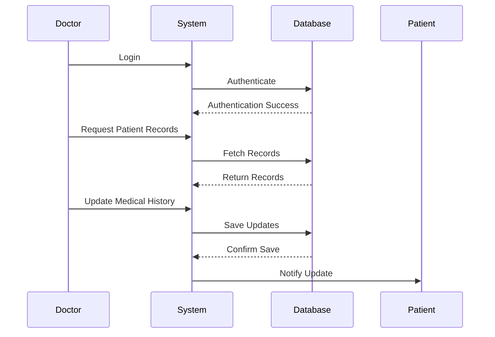
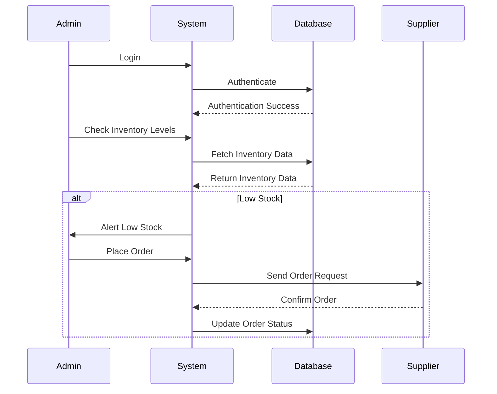
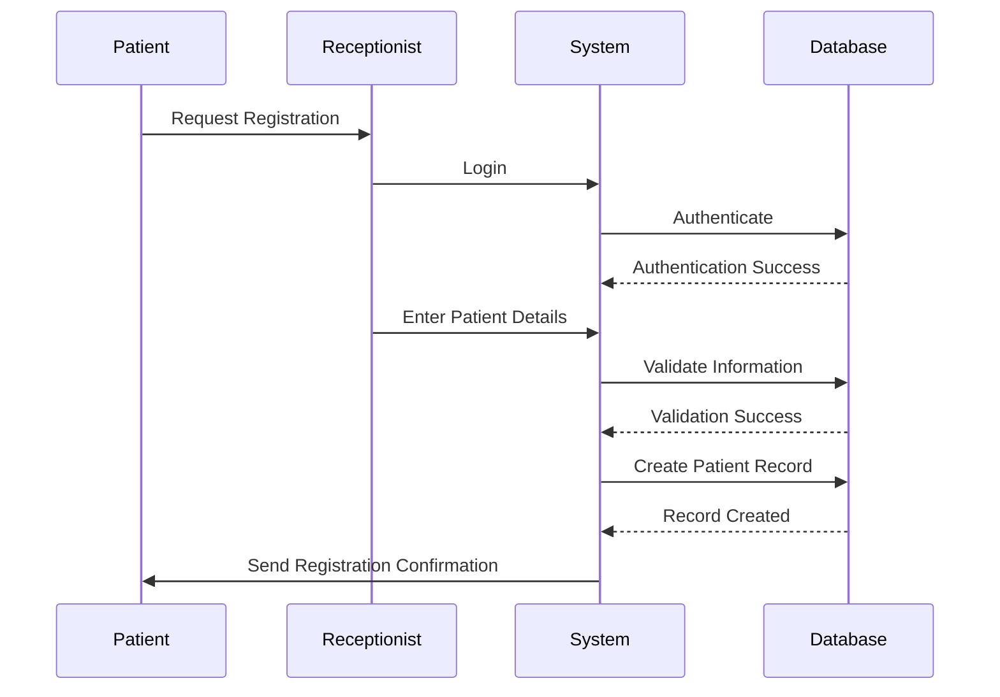
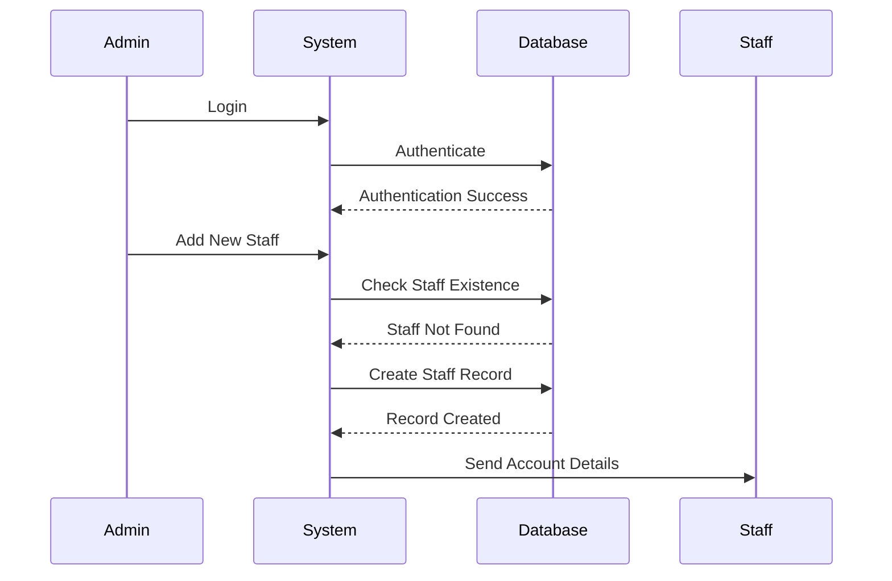

# System Diagrams

## Use Case Diagram

```mermaid
graph TD
    %% Actors
    Patient[Patient]
    Doctor[Doctor]
    Admin[Administrator]
    Nurse[Nurse]
    Receptionist[Receptionist]

    %% Use Cases
    subgraph Authentication
        Login[Login]
        Logout[Logout]
        Register[Register]
    end

    subgraph Patient Management
        ViewProfile[View Profile]
        UpdateProfile[Update Profile]
        BookAppointment[Book Appointment]
        ViewMedicalHistory[View Medical History]
    end

    subgraph Doctor Management
        ViewSchedule[View Schedule]
        UpdateSchedule[Update Schedule]
        ViewPatientRecords[View Patient Records]
        PrescribeMedication[Prescribe Medication]
    end

    subgraph Admin Management
        ManageUsers[Manage Users]
        ManageStaff[Manage Staff]
        GenerateReports[Generate Reports]
        ManageInventory[Manage Inventory]
    end

    subgraph Nurse Management
        UpdatePatientStatus[Update Patient Status]
        ViewPatientVitals[View Patient Vitals]
        ManageMedication[Manage Medication]
    end

    subgraph Receptionist Management
        ManageAppointments[Manage Appointments]
        ProcessPayments[Process Payments]
        RegisterPatient[Register Patient]
    end

    %% Relationships
    Patient --> Login
    Patient --> Logout
    Patient --> Register
    Patient --> ViewProfile
    Patient --> UpdateProfile
    Patient --> BookAppointment
    Patient --> ViewMedicalHistory

    Doctor --> Login
    Doctor --> Logout
    Doctor --> ViewSchedule
    Doctor --> UpdateSchedule
    Doctor --> ViewPatientRecords
    Doctor --> PrescribeMedication

    Admin --> Login
    Admin --> Logout
    Admin --> ManageUsers
    Admin --> ManageStaff
    Admin --> GenerateReports
    Admin --> ManageInventory

    Nurse --> Login
    Nurse --> Logout
    Nurse --> UpdatePatientStatus
    Nurse --> ViewPatientVitals
    Nurse --> ManageMedication

    Receptionist --> Login
    Receptionist --> Logout
    Receptionist --> ManageAppointments
    Receptionist --> ProcessPayments
    Receptionist --> RegisterPatient
```

## Sequence Diagrams

### Patient Appointment Booking

### Medical Record Update

### Inventory Management

### Patient Registration

### Staff Management

These diagrams illustrate the main interactions and workflows in the Hospital Management System. The use case diagram shows the different actors and their interactions with the system, while the sequence diagrams detail specific processes and their flow. 